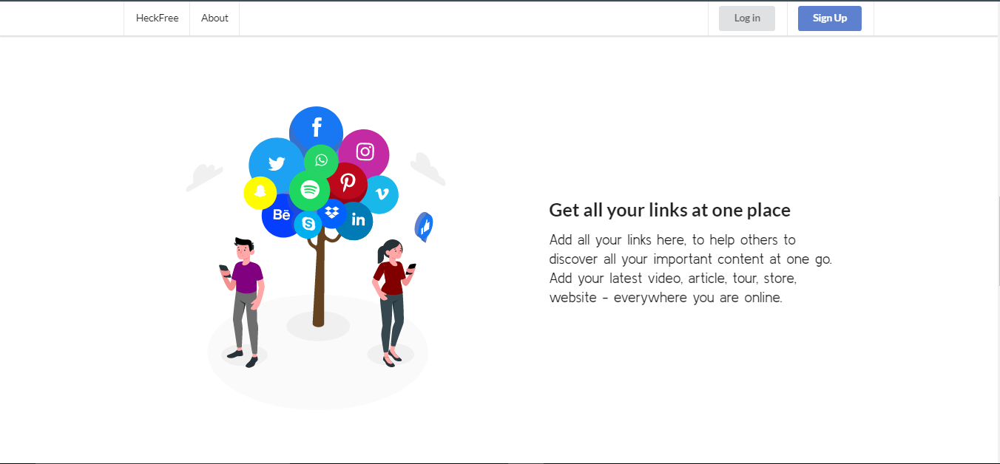

<h2 style="text-align:center;font-size:53px;color:red">HECKFREE</h2>

<h3 style="text-align:center;color:yellow;font-size:1.8rem;">Share One and Connect with Many</h3>

The only link you will ever need

We're a tool for connecting followers to your entire online arena and manage all your links with ease.

<h2>Dashboard for managing User's Acccount</h2>

<h2></h2>
<h1 style="margin-top:40px;">Features</h1>
<li style="font-size:1.5rem;color:yellow;">Get all your links at one place</li>
<li style="font-size:1.5rem;color:yellow;">Manage Easily</li>
<li style="font-size:1.5rem;color:yellow;">Multiple Design Template to chose From</li>

<h1 style="margin-top:50px">Tech-Stacks:</h1>

 

<h1 style="margin-top:40px;">Our Team
</h1>

  
  
  

